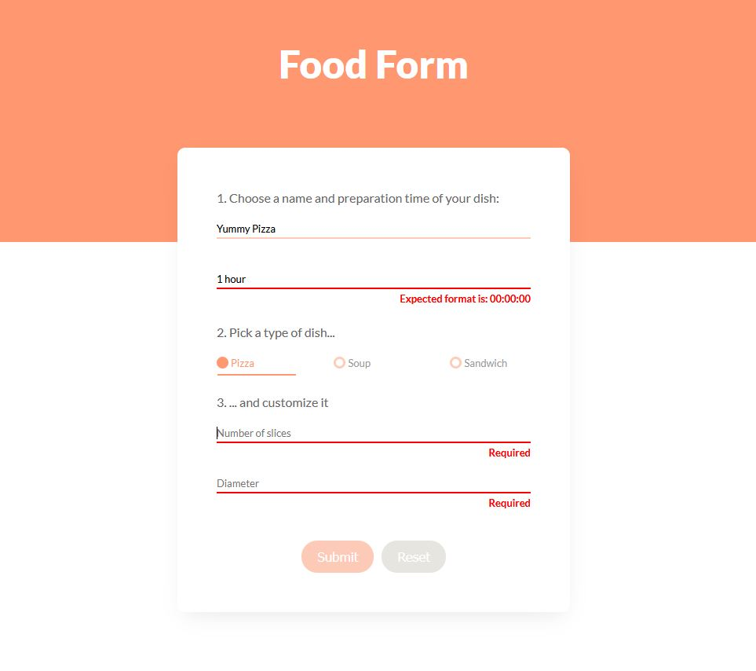

# Food Form

Food Form is a form where user can choose a name, preparation time, type of a dish picked within 3 options: pizza, soup and sandwich and customization options of each dish. All input fields are required and each of them has different validation rules.

**Link to project**



## How To Run It Locally

1. Clone the repo

```sh
   git clone https://github.com/pskrzypek97/food-form.git
```

2. Install NPM packages

```sh
    npm install
```

3. Run the development server:

```sh
    npm start
```

4. Open [http://localhost:3000](http://localhost:3000) with your browser to see the result.

## Tech Used

- TS
- CSS3
- [React](https://pl.reactjs.org/)
- [React-Final-Form](https://final-form.org/react/)
